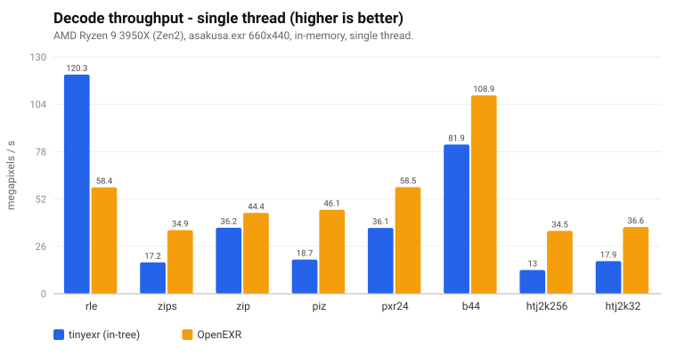
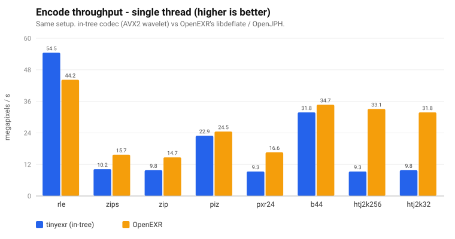
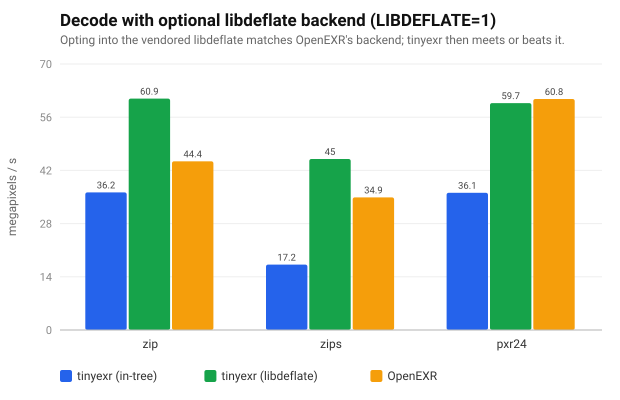
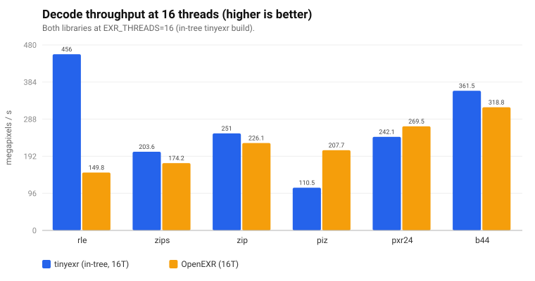

# TinyEXR vs OpenEXR — performance

How the pure-C11 TinyEXR v3 codec stacks up against the reference **OpenEXR**
library, codec by codec, for encode and decode — single-threaded and
multi-threaded.

> **Setup & method**
> - **CPU:** AMD Ryzen 9 3950X (16C/32T, Zen2), `avx2+f16c`. Machine idle.
> - **Image:** `asakusa.exr`, 660×440, 4× HALF. (Small — see the caveat in
>   [Multi-threading](#multi-threading) about chunk-count-limited scaling.)
> - **I/O:** fully in memory (`StdOSStream`/`StdISStream` on the OpenEXR side);
>   each library loads the same source independently. OpenEXR 4.0-dev, `gcc -O3`.
> - Throughput is **megapixels/second** (higher is better); sizes are the
>   compressed payload. Numbers vary a few % run-to-run.
> - Both libraries are pinned to the same thread count
>   (`Imf::setGlobalThreadCount(n)` / `exr_set_num_threads(n)`).

## TL;DR

- **Single-thread decode:** TinyEXR wins big on the cheap codecs — **3.4×** on
  uncompressed and **2.5×** on RLE. On the DEFLATE family / PIZ / HTJ2K, OpenEXR
  leads (≈1.2× ZIP, ≈1.8× PXR24, ≈2–2.7× ZIPS/PIZ/HTJ2K) because of its
  **libdeflate** backend and tuned PIZ/JPH.
- **Single-thread encode:** TinyEXR ties or wins on RLE/PIZ/B44; OpenEXR is
  ≈1.5× on ZIP/ZIPS, ≈1.8× on PXR24, and ≈3× on HTJ2K.
- **libdeflate (opt-in):** with the same backend, TinyEXR **matches or beats**
  OpenEXR on the deflate family — e.g. **ZIP decode 1.4×** single-thread.
- **Multi-threaded:** TinyEXR's opt-in parallel path scales ~5–9× to 16 threads;
  at 16T it **out-decodes OpenEXR on RLE/ZIP/ZIPS/B44** (in-tree), and with
  libdeflate it leads the whole deflate family by a wide margin.

## Single thread

### Decode



`none` (uncompressed) is off the chart on purpose: **TinyEXR 2699 vs OpenEXR
789 MP/s** (~3.4×) — no thread-pool or framebuffer-copy overhead. TinyEXR also
leads **RLE** (230 vs 93, ~2.5×). On the compressed codecs OpenEXR is ahead —
ZIP ~1.2×, PXR24 ~1.8×, ZIPS ~2.1×, PIZ ~2.7×, HTJ2K ~2–2.4× — dominated by its
libdeflate inflate (and tuned PIZ/JPH). A TinyEXR ZIP-decode profile is ~95 %
inflate; the predictor and de-interleave passes are already vectorized.

### Encode



TinyEXR ties or beats OpenEXR on **RLE / PIZ / B44**. On **ZIP/ZIPS** it is ~1.5×
behind and **PXR24** ~1.8× — its in-tree, dependency-free LZ77 encoder is fast
but not libdeflate-level. **HTJ2K** encode is the widest gap (~3×: the separate
JPH/OpenJPH encoder). TinyEXR's HTJ2K paths recently gained an AVX2 forward 5/3
wavelet, an unstuffed-buffer entropy reader, and a `clz`-builtin fast path in the
per-sample prepare (encode +~39%, decode +~18% vs the pre-SIMD baseline). The
decode path then restructured the inverse 5/3 **column** pass into a
column-parallel, gather/scatter-free AVX2 vertical lifting (mirroring OpenJPH —
columns are the natural SIMD axis), and vectorized the sign-magnitude → signed
coefficient extraction; together these cut decode wavelet+extraction time
materially (~16% faster all-HALF decode on the dev box). The same
column-parallel restructuring was then applied to the **forward** 5/3 (encode,
byte-identical output, ~7% faster htj2k256 encode) and to the **int64** inverse
5/3 used for float/32-bit channels (AVX2 1D + vertical, ~18% faster float
decode). The cleanup-pass entropy decoder's MagSgn reconstruction was then
restructured to a per-quad reader (`JphQuadMs`): one bit-window read per quad
(lazy upper half) replacing four per-sample stream fetches, ~4% faster all-HALF
decode. The remaining gap is OpenJPH's fully-SIMD entropy coder (cleanup VLC/MEL
+ MagSgn + per-sample mag-bit encode), which dominates both profiles; SIMD-ing
the decode MagSgn step beyond the scalar per-quad reader was tried (1- and
2-quad AVX2 kernels) and did not pay off on this hardware — the per-quad scalar
path already minimizes the bit-I/O the SIMD would amortize (see
`doc/htj2k-entropy-simd-scope.md`).

### Compression size

Sizes are essentially identical for the lossless/standard codecs — the formats
are interoperable (a TinyEXR file decodes in OpenEXR and vice-versa). Only ZIP
and HTJ2K differ, from encoder *tuning* (not format):

| codec | TinyEXR KB | OpenEXR KB | | codec | TinyEXR KB | OpenEXR KB |
|---|--:|--:|---|---|--:|--:|
| none | 2276 | 2276 | | pxr24 | 1158 | 1163 |
| rle  | 1644 | 1644 | | b44   |  993 |  993 |
| zips | 1205 | 1212 | | htj2k256 | 1132 | 1016 |
| zip  | 1155 | 1070 | | htj2k32  | 1160 | 1042 |
| piz  |  742 |  742 | | | | |

### Optional: the libdeflate backend

OpenEXR's deflate speed comes from libdeflate. TinyEXR vendors **libdeflate 1.25**
(MIT) as an **optional, off-by-default** backend for ZIP/ZIPS/PXR24 (the in-tree
codec stays the default and the only freestanding path):

```sh
make bench-compare LIBDEFLATE=1     # -DEXR_USE_LIBDEFLATE, level 4 (= OpenEXR)
```



Same backend ⇒ byte-identical sizes, and TinyEXR **meets or beats** OpenEXR:
**ZIP decode 80.8 vs 58.8 MP/s (1.37×)**, ZIPS 61.4 vs 46.4 (1.32×), PXR24 at
parity. Encode reaches parity too (ZIP 15.3 vs 14.0, PXR24 16.4 vs 15.8). Both
call libdeflate's inflate; TinyEXR's edge is its SSE2/AVX2 predictor and lower
per-block overhead.

### Full single-thread numbers

In-tree default:

| codec | tx enc | exr enc | tx dec | exr dec |
|-------|-------:|--------:|-------:|--------:|
| none  | 102.3 | 85.3 | 2699 | 789 |
| rle   | 55.1 | 46.3 | 230  | 92.6 |
| zips  | 10.3 | 15.5 | 23.2 | 48.9 |
| zip   | 9.6  | 14.7 | 50.4 | 61.9 |
| piz   | 23.6 | 25.4 | 24.6 | 67.5 |
| pxr24 | 9.2  | 16.4 | 48.0 | 88.0 |
| b44   | 31.7 | 34.8 | 145  | 178 |
| htj2k256 | 11.0 | 33.2 | 24.0 | 59.6 |
| htj2k32  | 11.6 | 31.6 | 27.1 | 55.0 |

`LIBDEFLATE=1` (deflate family): zip 15.3/14.0/80.8/58.8, zips 16.2/14.8/61.4/46.4,
pxr24 16.4/15.8/83.6/83.8 (tx enc / exr enc / tx dec / exr dec).

## Multi-threading

TinyEXR supports **per-block parallel encode and decode** via portable C11
`<threads.h>` and a small ephemeral worker pool. It is **opt-in** (build
`THREADS=1` / `-DEXR_USE_THREADS`; default and freestanding builds stay
single-threaded); the count is set at runtime:

```c
exr_set_num_threads(16);   /* 0/1 = serial (default) */
```

It covers scanline and single-level tiled parts on the in-memory load/save paths;
deep, mipmap/ripmap, and the streaming APIs remain single-threaded. Encode stays
byte-deterministic and decode bit-identical regardless of thread count (unit-tested).

### Scaling


TinyEXR decode scales **~5× (ZIP, 28 blocks)** to **~8.8× (ZIPS, 440 blocks)** at
16 threads. Scaling is bounded by the number of chunks: `asakusa.exr` is small,
so ZIP (16 lines/block ⇒ 28 blocks) saturates earlier than ZIPS (1 line/block ⇒
440 blocks). Larger images would scale further. (`none` decode does *not* benefit
— it is memory-bound with no per-block work, so thread overhead dominates.)

### TinyEXR vs OpenEXR at 16 threads



Both libraries at `EXR_THREADS=16`, in-tree TinyEXR build. TinyEXR out-decodes
OpenEXR on **RLE (456 vs 150), ZIP (251 vs 226), ZIPS (204 vs 174), B44 (362 vs
319)**; OpenEXR still leads **PIZ (208 vs 110)** and edges **PXR24 (270 vs 242)**.

With **`LIBDEFLATE=1` at 16 threads** TinyEXR leads the deflate family decisively:

| codec | tx dec | exr dec | | tx enc | exr enc |
|-------|-------:|--------:|---|-------:|--------:|
| zip   | **339.6** | 226.6 | | **102.3** | 88.0 |
| zips  | **358.5** | 151.1 | | **153.1** | 82.2 |
| pxr24 | **341.7** | 285.0 | | **105.7** | 96.9 |

(MP/s. OpenEXR's own per-block scaling is included — this is a like-for-like
16-thread comparison.)

Reproduce:

```sh
make bench-compare THREADS=1                         # single thread (default)
EXR_THREADS=16 ./build/bench_compare                 # 16 threads, both libs
make bench-compare THREADS=1 LIBDEFLATE=1            # + libdeflate backend
```

Still future work: parallelize the deep and mipmap/ripmap paths; add ARM/NEON
throughput numbers (the NEON path is correctness-verified under qemu but not
benchmarked here); sweep larger images and channel counts.

---

*Charts: `doc/perf-decode.svg`, `perf-encode.svg`, `perf-libdeflate-decode.svg`,
`perf-mt-scaling.svg`, `perf-mt-compare.svg`. Harness:
`benchmark/bench_compare.cpp` (`make bench-compare [THREADS=1] [LIBDEFLATE=1]`).*
